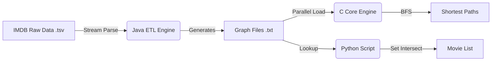

# IMDB-Graph-Explorer: Large-Scale Graph Processing

> **University Project, Laboratory II (Final Project)**
> **Algorithmic Engineering & Systems Programming**
> A multi-language distributed system designed to parse the entire IMDB dataset, construct a massive co-starring graph, and perform parallel shortest-path analysis using advanced data structures.

| Info | Details |
| :--- | :--- |
| **👤 Author** | **Giovanni Del Bianco** |
| **☕ ETL Engine** | **Java** (Stream Processing, HashMap Indexing) |
| **🚀 Core Engine** | **C99** (Pthreads, BFS, Binary Search Trees) |
| **🐍 Analytics** | **Python 3** (Set Operations) |
| **🧠 Key Concepts** | **Graph Theory**, **Producer-Consumer**, **IPC (Pipes)**, **Self-Pipe Trick**, **Memory Optimization**. |
| **🎯 Goal** | Process 4M+ entities and 40M+ edges to find "Kevin Bacon numbers" (degrees of separation) efficiently. |

---

## 🎬 Project Overview

### The Problem: Six Degrees of Separation
This project tackles the challenge of analyzing the vast network of connections in the movie industry using real-world data from **IMDb**. The goal is to build a graph where:
*   **Nodes** are actors/actresses.
*   **Edges** represent a collaboration in a shared movie titles.

Given the scale of the dataset (Gigabytes of TSV text files), a naive implementation would exhaust system memory or take hours to run.

### The Solution: A Three-Stage Pipeline
To ensure performance and maintainability, the system is architected in three distinct stages, each leveraging the strengths of a specific language:

1.  **Data Ingestion (Java):** A memory-efficient parser that filters raw TSV data and constructs the adjacency list representation of the graph (`grafo.txt`) and an index of actor names (`nomi.txt`). It uses a streaming approach to process movie casts without loading the entire file into RAM.
2.  **Pathfinding Engine (C):** A high-performance executable that loads the graph into optimized C structures. It uses a pool of **consumer threads** to parse the graph in parallel and a pool of **worker threads** to execute **Breadth-First Search (BFS)** queries, calculating the shortest path between any two actors.
3.  **Collaborations Query (Python):** A utility script that cross-references the generated participation data to list exactly *which* movies two actors worked on together.

---

## 🏗️ Architecture & Pipeline



---

## ☕ Phase 1: Data Engineering (Java)

The Java component (`CreaGrafo.java`) acts as the Extract-Transform-Load (ETL) layer. Its primary responsibility is to distill raw gigabyte-sized datasets into a compact graph format suitable for the C engine.

### 1. Optimized Parsing Strategy (`name.basics.tsv`)
Processing millions of lines requires efficient I/O management. The parsing logic is designed to filter data on the fly:
*   **Buffered Reading:** Uses `BufferedReader` to minimize disk access latency.
*   **Tokenization:** Each line is split by the tab delimiter (`\t`).
*   **Strict Filtering:** The system immediately discards entries that do not meet the criteria (e.g., missing birth year `\N` or professions not containing "actor/actress").
*   **In-Memory Indexing:** Valid actors are stored in a `HashMap<Integer, Attore>`.
    *   **Key:** The integer ID derived from the `nconst` string (e.g., `nm0000102` -> `102`). This allows **O(1)** retrieval time during the subsequent graph construction phase.

### 2. Stream-Based Edge Generation (`title.principals.tsv`)
Instead of loading the massive relationships file into memory, the program utilizes the file's natural sorting (grouped by `tconst`) to implement a **streaming algorithm**:
1.  **Accumulation:** The parser reads lines sequentially, accumulating actor IDs into a temporary `Set<Integer> currentCast`.
2.  **Trigger:** When the movie ID (`tconst`) changes, the system detects that the cast for the previous movie is complete.
3.  **Clique Formation:** The method `processCast` generates a complete subgraph (clique) for the actors in `currentCast`. It adds a bidirectional edge between every pair of actors in the set.
4.  **Flush:** The set is cleared, and memory is reused for the next movie.

### 3. Storing Participations
To support the full query system, the `Attore` class maintains two specific data structures:
```java
class Attore {
    Set<Integer> coprotagonisti;    // Adjacency List (Edges)
    Set<Integer> titoliPartecipati; // Movie IDs (Data for Python)
}
```
*   **Usage of Sets:** `HashSet` is chosen over `ArrayList` to guarantee uniqueness (an actor cannot be a co-star of themselves or listed twice for the same connection) and to provide constant-time performance for insertions.

---

## 🚀 Phase 2: The C Computational Core

The C program (`cammini.c`) is engineered for speed. It loads the pre-processed graph and spawns worker threads to solve the Shortest Path problem using **Breadth-First Search (BFS)**.

### 1. High-Performance Graph Loading
To parse the massive `grafo.txt` file (40M+ edges), a sequential read would be too slow. The system implements a **Producer-Consumer** pattern:
*   **Main Thread (Producer):** Reads lines from the file and pushes raw strings into a thread-safe `line_buffer_t`.
*   **Worker Threads (Consumers):** Multiple threads pull lines from the buffer, parse the integers, and populate the pre-allocated adjacency arrays (`attore->cop`) in parallel using fine-grained memory reallocation (`realloc` with exponential growth strategy).

### 2. BFS Implementation & Data Structures
The search algorithm relies on two custom-built structures to manage the exploration frontier and history.

#### 🔹 The FIFO Queue (Frontier)
A lightweight linked-list queue manages the nodes to visit.
*   **Structure:** `q_node_t` contains only the `int codice` and a `next` pointer.
*   **Efficiency:** By storing only integer IDs (4 bytes) instead of full pointers, cache locality is improved and memory overhead is minimized. Operations `enqueue` and `dequeue` are O(1).

#### 🔹 The Binary Search Tree (History & Visited Set)
To avoid cycles and reconstruct the path, visited nodes are stored in a Balanced Binary Search Tree (ABR).
*   **Node Structure:**
    ```c
    typedef struct abr_node {
        int shuffled_codice; // Key for balancing
        int original_codice; // Actual Actor ID
        int parent_codice;   // Back-pointer to the predecessor
        // ... left/right pointers
    } abr_node_t;
    ```
*   **Path Reconstruction:** The `parent_codice` field is the "breadcrumb". Once the target is reached, the algorithm backtracks from *Target* → *Parent* → *Parent's Parent* → ... until it reaches the *Source* (marked with -1).
*   **The Shuffle Trick:** Since actor IDs are often sequential, inserting them directly into a BST would create a degenerate linked list (height O(N)). The system applies a bitwise `shuffle()` function to IDs before insertion, effectively randomizing the keys and keeping the tree balanced (height O(log N)).

### 3. System Programming: Robust Signal Handling
The application must respond gracefully to `SIGINT` (Ctrl+C) without crashing, even when blocked on I/O operations. This is achieved via the **Self-Pipe Trick**:
1.  **Signal Masking:** `SIGINT` is blocked in all threads using `pthread_sigmask`.
2.  **Dedicated Thread:** A separate thread waits on `sigwait()`.
3.  **Notification:** When a signal arrives, the handler writes a single byte to a specific pipe (`S_SELF_PIPE_FD`).
4.  **Event Loop:** The main thread uses `select()` to monitor both the data pipe (from external commands) and the self-pipe. When `select()` detects activity on the self-pipe, it triggers a clean shutdown sequence.

---

## 🐍 Phase 3: Analytics (Python)

The final component, `collaborazioni.py`, answers the user's specific questions about the relationship between two actors.
*   **Input:** Reads the `partecipazioni.txt` file (generated by Java) and `title.basics.tsv`.
*   **Logic:** It loads the data into efficient Python `set` structures. To find collaborations, it performs a **Set Intersection** between the movie lists of two actors.
*   **Result:** Outputs the exact titles of the movies they worked on together.

---

## 🛠️ Tech Stack & Requirements

*   **Languages:**
    *   **Java 8+** (with `-Xmx4g` for large heap).
    *   **C99** (`gcc`, `pthread`, `math`).
    *   **Python 3.x**.
*   **OS:** Linux (Mandatory for POSIX signals and pipes).
*   **Tools:** GNU Make, Valgrind (for memory checks).

---

## 📂 Repository Structure

```text
IMDB-Graph-Explorer/
├── CreaGrafo.java        # Java Source: ETL and Graph Construction
├── cammini.c             # C Source: Multithreaded BFS Engine
├── collaborazioni.py     # Python Script: Collaborative Filtering
├── Makefile              # Unified build script
├── README.md             # Project Documentation
└── (Generated Files)     # nomi.txt, grafo.txt, partecipazioni.txt
```

---

## ⚙️ Build & Execution Guide

The project uses a unified `Makefile` to handle the compilation of both Java and C components.

### 1. Build Everything
Compiles the C engine (optimized mode) and Java classes.
```bash
make
```

### 2. Run the Data Pipeline (Java)
Parses the raw TSV files and generates the graph. Ensure you have the dataset files in the current directory.
```bash
# Usage: make run_java
make run_java
```
*Outputs: `nomi.txt`, `grafo.txt`, `partecipazioni.txt`.*

### 3. Run the Core Engine (C)
Launch the pathfinding server.
```bash
# Syntax: ./cammini.out <names_file> <graph_file> <num_consumer_threads>
./cammini.out nomi.txt grafo.txt 4
```
*The program will load the graph and wait for queries on `cammini.pipe`.*

### 4. Query Collaborations (Python)
Find out which movies two actors share.
```bash
# Syntax: python3 collaborazioni.py <participations_file> <titles_file> <id1> <id2> ...
python3 collaborazioni.py partecipazioni.txt title.basics.tsv 350125 7746
```


## 📜 License

This project is released under the MIT License. For full details, please consult the LICENSE file included in the repository.